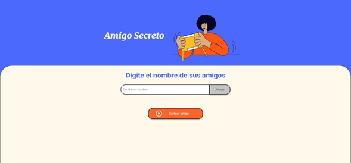

# Challenge Amigo Secreto

Este proyecto consiste en hacer uso de los conocimientos acerca de la implementación de arrays, funciones, tipo de datos y todo el conocimiento
obtenido en el curso de logica de programacion con javaScript.

### Imagenes


### Funcionalidades
_Agregar nombres: Los usuarios pueden escribir el nombre de un amigo en un campo de texto y agregarlo a una lista visible al hacer clic en el botón "Adicionar".
Validar entrada: Si el campo de texto está vacío, se mostrará una alerta solicitando un nombre válido.
Visualizar la lista: Los nombres ingresados se mostrarán en una lista debajo del campo de entrada.
Sorteo aleatorio: Al hacer clic en el botón "Sortear Amigo", se seleccionará aleatoriamente un nombre de la lista y se mostrará en pantalla._

## Comenzando 🚀

_Sigue estos pasos para obtener una copia del proyecto y empezar a trabajar localmente.._


### Pre-requisitos 📋

_No necesitas herramientas adicionales para ejecutar este proyecto. Solo asegúrate de tener un navegador web como Firefox, Chrome, o sus variaciones. Si trabajas con Visual Studio Code, puedes utilizar la extensión Live Server para una experiencia más fluida._


### Instalación 🔧

_Una serie de ejemplos paso a paso que te dice lo que debes ejecutar para tener un entorno de desarrollo ejecutandose_

_Dí cómo será ese paso_
1. Clona el repositorio en tu máquina local:
```
git clone https://github.com/tsanchezru/challenge-as.git
```
2. Usted puede abrir directamente la carpeta del proyecto y una vez dentro de ella en el explorador  haga clic derecho y abra la terminal de git o usar el siguiente comando para posicionarse en la carpeta del proyecto:

```
cd challenge-as
```
3. abra  el archivo index.html seguns su gusto, desde VScode usando liveserver o directamente desde el explorador y eligiendo un navegador para la ejecucion del proyecto.


_Finaliza con un ejemplo de cómo obtener datos del sistema o como usarlos para una pequeña demo_

## Ejecutando Localmente⚙️

_Este proyecto no requiere ninguna instalación adicional. Simplemente abre el archivo index.html en tu navegador y empieza a usar la aplicación._


## Construido con 🛠️

_Menciona las herramientas que utilizaste para crear tu proyecto_

HTML - Para la estructura y diseño de la página.
CSS - Para los estilos visuales.
JavaScript - Para la lógica de la aplicación.


## Autores ✒️

_He recibido una base del codigo en html y CSS, pero el trabajo de logica de programacion ha sido desarrollado con el conocimiento aduqirido de los tutores
de Alura_

* **Teodomiro Sanchez** - *Trabajo Inicial* - [tsanchezru](https://github.com/villanuevand)


---
⌨️ con ❤️ por [tsanchezru](https://github.com/tsanchezru) 😊